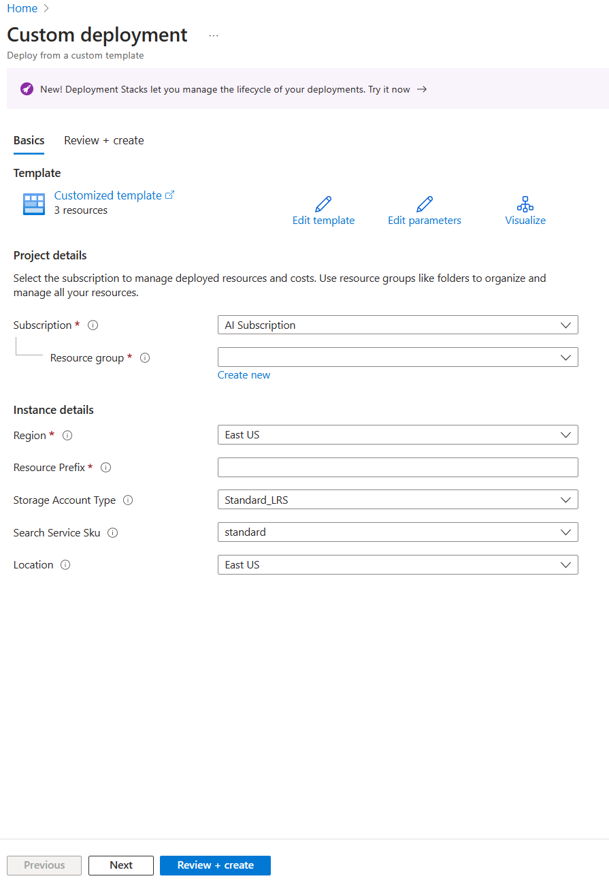
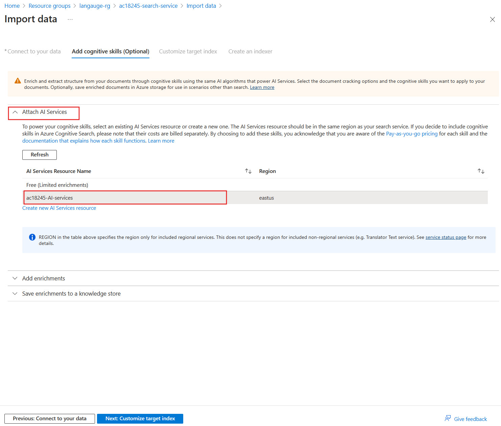

---
lab:
  title: Enriquecer um índice de pesquisa de IA com classes personalizadas
---

# Enriquecer um índice de pesquisa de IA com classes personalizadas

Você criou uma solução de pesquisa e agora deseja adicionar os Serviços de IA do Azure para enriquecimento de linguagem aos seus índices.

Neste exercício, você criará uma solução de Pesquisa de IA do Azure e enriquecerá um índice com os resultados de um projeto de classificação de textos personalizada do Language Studio. Você criará um aplicativo de funções para conectar a pesquisa e o modelo de classificação.

> **Observação** Para concluir este exercício, você precisará de uma assinatura do Microsoft Azure. Caso ainda não tenha uma, inscreva-se em uma avaliação gratuita em [https://azure.com/free](https://azure.com/free?azure-portal=true) .

## Configurar o ambiente de desenvolvimento com Python, VS Code e extensões do VS Code

Instale essas ferramentas para concluir o exercício. Você ainda pode acompanhar as etapas sem essas ferramentas.

1. Instalar o [VS Code](https://code.visualstudio.com/)
1. Instalar a [Azure Core Functions Tool](https://github.com/Azure/azure-functions-core-tools)
1. Instalar as [Extensões das Ferramentas do Azure para VS Code](https://code.visualstudio.com/docs/azure/extensions)
1. Instalar o [Python 3.8](https://www.python.org/downloads/release/python-380/) para o sistema operacional.
1. Instalar a [Extensão do Python para VS Code](https://marketplace.visualstudio.com/items?itemName=ms-python.python)

## Configurar os recursos do Azure

Para economizar tempo, selecione este modelo do ARM do Azure para criar os recursos que serão necessários posteriormente no exercício.

### Implantar um modelo do ARM pré-criado

1. [](https://portal.azure.com/#create/Microsoft.Template/uri/https%3A%2F%2Fraw.githubusercontent.com%2FMicrosoftLearning%2Fmslearn-knowledge-mining%2Fmain%2FLabfiles%2F04-enrich-custom-classes%2Fazuredeploy.json) selecione este link para criar seus recursos iniciais. Talvez seja necessário copiar e colar o [link direto](https://portal.azure.com/#create/Microsoft.Template/uri/https%3A%2F%2Fraw.githubusercontent.com%2FMicrosoftLearning%2Fmslearn-knowledge-mining%2Fmain%2FLabfiles%2F04-enrich-custom-classes%2Fazuredeploy.json) na barra de pesquisa.

    
1. Em **Grupo de recursos**, selecione **Criar** e dê a ele o nome **cog-search-language-exe**.
1. Em **Região**, selecione uma [região com suporte](https://learn.microsoft.com/azure/ai-services/language-service/concepts/regional-support) próxima a você.
1. O **Prefixo do recurso** precisa ser globalmente exclusivo. Insira um prefixo com caracteres numéricos aleatórios e letras minúsculas, por exemplo, **acs18245**.
1. Em **Local**, selecione a mesma região escolhida acima.
1. Selecione **Examinar + criar**.
1. Selecione **Criar**.

    > **Observação** Um erro é mostrado, **Você precisará concordar com os termos de serviço abaixo para criar o recurso com êxito**. Ao selecionar **Criar**, você está concordando com eles.

1. Selecione **Ir para o grupo de recursos** para ver todos os recursos criados.

    
Você vai configurar um índice do Azure Cognitive Search, criar uma função do Azure e criar um projeto do Language Studio para identificar gêneros de filmes com base nas sinopses deles.

### Carregar dados de exemplo para treinar serviços de linguagem

Este exercício usa 210 arquivos de texto que contêm sinopses de filmes. Os nomes dos arquivos de texto são os títulos dos filmes. A pasta também contém um arquivo **movieLabels.json** que mapeia os gêneros dos filmes para os arquivos, e para cada arquivo há uma entrada JSON como esta:

```json
{
    "location": "And_Justice_for_All.txt",
    "language": "en-us",
    "classifiers": [
        {
            "classifierName": "Mystery"
        },
        {
            "classifierName": "Drama"
        },
        {
            "classifierName": "Thriller"
        },
        {
            "classifierName": "Comedy"
        }
    ]
},
```

1. Navegue até **Labfiles/04-enrich-custom-classes** e extraia a pasta **movies summary.zip** que contém todos os arquivos.

    > **Observação** Você usará esses arquivos para treinar um modelo no Language Studio e também indexará todos os arquivos na Pesquisa de IA do Azure.

1. No [portal do Azure](https://portal.azure.com/), selecione **Grupos de recursos** e, em seguida, escolha o seu grupo de recursos.
1. Selecione a conta de armazenamento que você criou, por exemplo, **acs18245str**.
1. Selecione **Configuração** no painel esquerdo, selecione a opção **Habilitar** para a configuração *Permitir acesso anônimo de Blob* e selecione **Salvar** na parte superior da página.

    

1. Selecione **Contêineres** à esquerda e **+ Contêiner**.
1. No painel **Novo contêiner**, em **Nome**, insira **language-studio-training-data**.
1. Em **Nível de acesso anônimo**, escolha **Contêiner (acesso de leitura anônimo para contêineres e blobs)** e selecione **Criar**.
1. Selecione o novo contêiner que você acabou de criar, **language-studio-training-data**.
    
1. Selecione **Carregar** na parte superior do painel.
1. No painel **Carregar blob**, selecione **Procurar arquivos**.
1. Navegue até onde você extraiu os arquivos de exemplo e selecione todos os arquivos de texto (`.txt`) e json (`.json`).
1. Selecione **Carregar** no painel.
1. Feche o painel **Carregar blob**.

### Criar um recurso de linguagem

1. No link de trilha de navegação na parte superior da página, selecione **Página Inicial**.
1. Selecione **+ Criar um recurso** e pesquise por *Serviço de linguagem*.
1. Selecione **Criar** em **Serviço de Linguagem**.
1. Selecione a opção que inclui **Classificação de texto personalizada e Reconhecimento de entidade nomeada personalizada**.
1. Selecione **Continuar para criar o recurso**.
1. Em **Grupo de recursos**, escolha **cog-search-language-exe**.
1. Em **Região**, selecione a região usada acima.
1. Em **Nome**, insira **learn-language-service-for-custom-text**. Isso precisa ser globalmente exclusivo, portanto, talvez seja necessário adicionar números ou caracteres aleatórios ao final dele.
1. Para tipo de **Preço**, selecione **S**.
1. Em **Conta de armazenamento nova/existente**, selecione **Conta de armazenamento existente**.
1. Em **Conta de armazenamento na assinatura e região dos recursos selecionados atualmente**, selecione a conta de armazenamento que você criou, por exemplo, **acs18245str**.
1. Concorde com os termos do **Aviso de IA Responsável** e selecione **Examinar + criar**.
1. Selecione **Criar**.
1. Espere que os recursos sejam implantados e selecione **Ir para o grupo de recursos**.
1. Selecione **learn-language-service-for-custom-text**.

    
1. Role para baixo no painel **Visão geral** e selecione **Introdução ao Language Studio**.
1. Entre no estúdio de linguagem. Se for solicitado que você escolha um recurso de Linguagem, selecione o recurso criado anteriormente.

### Criar um projeto de classificação de textos personalizada no Language Studio

1. Na home page do Language Studio, selecione **Criar** e selecione **Classificação de textos personalizada**.

    

1. Selecione **Avançar**.

    
1. Selecione **Classificação de vários rótulos** e **Avançar**.

    

1. Em **Nome**, insira **movie-genre-classifier**.
1. Em **Idioma principal do texto**, selecione **Inglês (EUA)**.
1. Em **Descrição**, insira **Um modelo capaz de identificar um gênero de filme com base na sinopse**.
1. Selecione **Sim, habilitar o conjunto de dados multilíngue**.
1. Selecione **Avançar**.

    

1. Em **Contêiner do armazenamento de blobs**, escolha **language-studio-training-data**.
1. Selecione **Sim, meus documentos já estão rotulados e tenho um arquivo de rótulos JSON formatado corretamente**.
1. Em **Rotular documentos**, escolha **movieLabels**.
1. Selecione **Avançar**.
1. Selecione **Criar projeto**.

### Treinar um modelo de IA de classificação de textos personalizada

1. À esquerda, selecione **Trabalhos de treinamento**.

    

1. Escolha **+ Iniciar um trabalho de treinamento**.

    
1. Em **Treinar um novo modelo**, insira **movie-genre-classifier**.
1. Selecione **Treinar**.
1. O treinamento do modelo de classificador deve levar menos de 10 minutos. Aguarde até que o status seja alterado para **Treinamento bem-sucedido**.

### Implantar um modelo de IA de classificação de textos personalizada

1. À esquerda, selecione **Implantar um modelo**.

    
1. Selecione **Adicionar uma implantação**.

    
1. Em **Criar um nome de implantação**, insira **test-release**.
1. Em **Modelo**, selecione **movie-genre-classifier**.
1. Selecione **Implantar**.

Deixe esta página da Web aberta para ser usada mais tarde neste exercício.

### Criar um índice da Pesquisa de IA do Azure

Crie um índice de pesquisa que você pode enriquecer com esse modelo, indexe todos os arquivos de texto que contêm as sinopses que você já baixou.

1. No [portal do Azure](https://portal.azure.com/), selecione **Grupos de recursos**, escolha seu grupo de recursos e, em seguida, selecione a conta de armazenamento que você criou, por exemplo, **acs18245str**.
1. Selecione **Contêineres** à esquerda e **+ Contêiner**.
1. No painel **Novo contêiner**, em **Nome**, insira **search-data**.
1. Em **Nível de acesso anônimo**, escolha **Contêiner**.
1. Selecione **Criar**.
1. Selecione o contêiner recém-criado, **search-data**.
1. Selecione **Carregar** na parte superior do painel.
1. No painel **Carregar blob**, selecione **Procurar arquivos**.
1. Navegue até onde você baixou os arquivos de exemplo e selecione **APENAS** os arquivos de texto (`.txt`).
1. Selecione **Carregar** no painel.
1. Feche o painel **Carregar blob**.

### Importar documentos para a Pesquisa de IA do Azure

1. À esquerda, selecione **Grupos de recursos**, escolha seu grupo de recursos e selecione seu serviço de pesquisa.

1. Selecione **Importar dados**.

    
1. Em **Fonte de dados**, selecione **Armazenamento de Blobs do Azure**.
1. Em **Nome da fonte de dados**, insira **movie-summaries**.
1. Selecione **Escolher uma conexão existente**, em seguida, selecione sua conta de armazenamento e escolha o contêiner que você acabou de criar, **search-data**.
1. Selecione **Adicionar habilidades cognitivas (opcional)**.
1. Expanda a seção **Anexar Serviços de IA** e selecione o serviço de IA do Azure criado anteriormente.

    
1. Expanda a seção **Adicionar enriquecimentos**.

    
1. Deixe todos os campos com os valores padrão e selecione **Extrair nomes de pessoas**.
1. Selecione **Extrair frases-chave**.
1. Selecione **Detectar idioma**.
1. Selecione **Avançar: Personalizar índice de destino**.

    
1. Deixe todos os campos com os valores padrão e, para **metadata_storage_name**, selecione **Recuperável** e **Pesquisável**.
1. Selecione **Próximo: Criar um indexador**.
1. Selecione **Enviar**.

O indexador será executado e criará um índice dos 210 arquivos de texto. Você não precisa esperar para prosseguir para as próximas etapas.

## Criar um aplicativo de funções para enriquecer o índice de pesquisa

Agora, você criará um aplicativo de funções Python que seu conjunto de habilidades personalizado da pesquisa cognitiva chamará. O aplicativo de funções usará o modelo de classificador de texto personalizado para enriquecer o índice de pesquisa.

1. [Baixe os arquivos necessários](https://github.com/MicrosoftLearning/mslearn-knowledge-mining/raw/main/Labfiles/04-enrich-custom-classes/movie-genre-function.zip) e extraia a pasta que contém todos os arquivos.
1. Abra o Visual Studio Code, abra a pasta **movie-genre-function** que você acabou de baixar.

    
1. Se você instalou todas as extensões necessárias, será solicitado que você otimize o projeto. Selecione **Sim** na barra superior.
    
1. Selecione o interpretador do Python, que deve ser a versão 3.8.
1. O workspace será atualizado. Se você for solicitado a conectá-lo à pasta do workspace, selecione **Sim**.
1. Pressione **F5** para depurar o aplicativo.

    
    Se o aplicativo estiver em execução, você deverá ver uma URL do localhost que poderá usar para testes locais.

1. Pare de depurar o aplicativo e pressione **SHIFT** + **F5**.

### Implantar o aplicativo de funções local no Azure

1. No Visual Studio Code, pressione **F1** para abrir a paleta de comandos.
1. Na paleta de comandos, pesquise e selecione `Azure Functions: Create Function App in Azure...`.
1. Insira um nome globalmente exclusivo para o aplicativo de funções, por exemplo, **acs13245str-function-app**.
1. Em **Selecionar uma pilha de runtime**, selecione **Python 3.8**.
1. Selecione a mesma localização usada acima.

1. No painel de navegação esquerdo, selecione a extensão do **Azure**.
    
1. Expanda **Recursos** e, dentro de sua assinatura, expanda **Aplicativo de Funções**. Em seguida, clique com o botão direito do mouse na função, por exemplo, **acs13245-function-app**.
1. Selecione **Implantar no aplicativo de funções**. Aguarde até que o aplicativo seja implantado.
1. Expanda o aplicativo, clique com o botão direito do mouse em **Configurações do Aplicativo** e selecione **Baixar Configurações Remotas**.
1. À esquerda, selecione **Explorador** e selecione **local.settings.json**.

    
O aplicativo de funções precisa ser conectado ao modelo de classificação de textos personalizada. Siga estas etapas para obter as configurações.

1. No navegador, navegue até o **Language Studio**; você deve estar na página **Implantar um modelo**.

    
1. Selecione seu modelo. Selecione **Obter URL de previsão**.
1. Selecione o ícone de cópia ao lado da **URL de Previsão**.
1. No Visual Studio Code, na parte inferior de **local.settings.json**, cole a URL de previsão.
1. No **Language Studio**, à esquerda, selecione **Configurações do projeto**.

    
1. Selecione o ícone de cópia ao lado de **Chave primária**.
1. No Visual Studio Code, na parte inferior de **local.settings.json**, cole a chave primária.
1. Edite as configurações para adicionar essas quatro linhas à parte inferior e copie o ponto de extremidade para o valor `TA_ENDPOINT`.

    ```json
    ,
    "TA_ENDPOINT": " [your endpoint] ",
    "TA_KEY": " [your key] ",
    "DEPLOYMENT": "test-release",
    "PROJECT_NAME": "movie-genre-classifier"
    ```

1. Copie a chave primária para o valor `TA_KEY`.

    ```json
    {
      "IsEncrypted": false,
      "Values": {
        "AzureWebJobsStorage": "DefaultEndpointsProtocol=https;AccountName=...",
        "FUNCTIONS_EXTENSION_VERSION": "~4",
        "FUNCTIONS_WORKER_RUNTIME": "python",
        "WEBSITE_CONTENTAZUREFILECONNECTIONSTRING": "DefaultEndpointsProtocol=https;AccountName=...",
        "WEBSITE_CONTENTSHARE": "acs...",
        "APPINSIGHTS_INSTRUMENTATIONKEY": "6846...",
        "TA_ENDPOINT": "https://learn-languages-service-for-custom-text.cognitiveservices.azure.com/language/analyze-text/jobs?api-version=2022-05-01",
        "TA_KEY": "7105e938ce1...",
        "DEPLOYMENT": "test-release",
        "PROJECT_NAME": "movie-genre-classifier"
      }
    }

    ```

    As configurações devem ter a aparência acima, com os valores do projeto.
 
1. Pressione **CTRL**+**S** para salvar as alterações em **local.settings.json**.
1. No painel de navegação esquerdo, selecione a extensão do **Azure**.
1. Expanda **Recursos** e, dentro da sua assinatura, expanda **Aplicativo de Funções**. Em seguida, clique com o botão direito do mouse em **Configurações do Aplicativo** e selecione **Carregar Configurações Locais**.

### Testar o aplicativo de funções remoto

Há uma consulta de exemplo que você pode usar para testar se o aplicativo de funções e o modelo de classificador estão funcionando corretamente.

1. À esquerda, selecione **Explorer**, expanda a pasta **customtextcla** e selecione **sample.dat**.

    
1. Copie o conteúdo do arquivo.
1. À esquerda, selecione a extensão do **Azure**.

    
1. Em **Aplicativo de Funções**, expanda **Funções**, clique com o botão direito do mouse em **customtextcla** e selecione **Executar função agora**.
1. Em **Inserir corpo da solicitação**, cole os dados de exemplo copiados e pressione **Enter**.

    O aplicativo de funções responderá com os resultados JSON.

1. Expanda a notificação para ver todos os resultados.

    
    A resposta JSON será parecida com esta:

    ```json
    {"values": 
        [
            {"recordId": "0", 
            "data": {"text": 
            [
                {"category": "Action", "confidenceScore": 0.99}, 
                {"category": "Comedy", "confidenceScore": 0.96}
            ]}}
        ]
    }
    ```

### Adicionar um campo ao índice de pesquisa

Você precisa de um lugar para armazenar o enriquecimento retornado pelo novo aplicativo de funções. Siga estas etapas para adicionar um novo campo composto para armazenar a classificação de texto e a pontuação de confiança.

1. No [portal do Azure](https://portal.azure.com/), vá para o grupo de recursos que contém o serviço de pesquisa e selecione o serviço de pesquisa cognitiva que você criou, por exemplo, **acs18245-search-service**.
1. No painel **Visão geral**, selecione **Índices**.
1. Selecione **azurebob-index**.
1. Selecione **Editar JSON**.
1. Adicione os novos campos ao índice, cole o JSON abaixo no campo de conteúdo.

    ```json
    {
      "name": "textclass",
      "type": "Collection(Edm.ComplexType)",
      "analyzer": null,
      "synonymMaps": [],
      "fields": [
        {
          "name": "category",
          "type": "Edm.String",
          "facetable": true,
          "filterable": true,
          "key": false,
          "retrievable": true,
          "searchable": true,
          "sortable": false,
          "analyzer": "standard.lucene",
          "indexAnalyzer": null,
          "searchAnalyzer": null,
          "synonymMaps": [],
          "fields": []
        },
        {
          "name": "confidenceScore",
          "type": "Edm.Double",
          "facetable": true,
          "filterable": true,
          "retrievable": true,
          "sortable": false,
          "analyzer": null,
          "indexAnalyzer": null,
          "searchAnalyzer": null,
          "synonymMaps": [],
          "fields": []
        }
      ]
    },
    ```

    Agora, o índice deverá ter a aparência a seguir.

    
1. Clique em **Salvar**.

### Editar o conjunto de habilidades personalizado para chamar o aplicativo de funções

O índice de pesquisa cognitiva precisa de uma maneira de preencher esses novos campos. Edite o conjunto de habilidades que você criou para chamar o aplicativo de funções.

1. Na parte superior da página, selecione o link do serviço de pesquisa, por exemplo, **acs18245-search-service | Índices**.

1. No painel **Visão geral**, selecione **Conjuntos de habilidades**.

    
1. Selecione **azureblob-skillset**.
1. Adicione a definição do conjunto de habilidades personalizado abaixo, colando-a como o primeiro conjunto de habilidades.

    ```json
    {
      "@odata.type": "#Microsoft.Skills.Custom.WebApiSkill",
      "name": "Genre Classification",
      "description": "Identify the genre of your movie from its summary",
      "context": "/document",
      "uri": "URI",
      "httpMethod": "POST",
      "timeout": "PT30S",
      "batchSize": 1,
      "degreeOfParallelism": 1,
      "inputs": [
        {
          "name": "lang",
          "source": "/document/language"
        },
        {
          "name": "text",
          "source": "/document/content"
        }
      ],
      "outputs": [
        {
          "name": "text",
          "targetName": "class"
        }
      ],
      "httpHeaders": {}
    },
    ```

Você precisa alterar o `"uri": "URI"` para apontar para o aplicativo de funções.

1. No Visual Studio Code, selecione a extensão do **Azure**.

    
1. Em **Funções**, clique com o botão direito do mouse em **customtextcla** e selecione **Copiar URL da Função**.
1. No portal do Azure, substitua o URI pela URL da função copiada. 
1. Clique em **Salvar**.

### Editar os mapeamentos de campo no indexador

Agora, você tem campos para armazenar o enriquecimento e um conjunto de habilidades para chamar o aplicativo de funções. A última etapa é informar à pesquisa cognitiva onde colocar o enriquecimento.

1. Na parte superior da página, selecione o serviço de pesquisa, por exemplo, **acs18245-search-service | Link para o conjunto de habilidades**.

    
1. No painel **Visão geral**, selecione **Indexadores**.
1. Selecione **azureblob-indexer**.
1. Selecione **Definição do Indexador (JSON)**.
1. Adicione um novo mapeamento de campo de saída colando essa definição de campo na parte superior da seção do campo de saída.

    ```json
    {
      "sourceFieldName": "/document/class",
      "targetFieldName": "textclass"
    },
    ```

    A definição JSON do indexador agora deve ter esta aparência:

    
1. Clique em **Salvar**.
1. Selecione **Redefinir** e **Sim**.
1. Selecione **Executar** e **Sim**.

    Seu serviço de pesquisa cognitiva do Azure executa o indexador atualizado. O indexador usa o conjunto de habilidades personalizado editado. O conjunto de habilidades chama o aplicativo de funções com o documento sendo indexado. O modelo de classificador de texto personalizado usa o texto no documento para tentar identificar o gênero do filme. O modelo retorna um documento JSON com gêneros e níveis de confiança. O indexador mapeia os resultados JSON para os campos em seu índice usando o novo mapeamento de campos de saída.

1. Selecione **Histórico de execução**.
1. Verifique se o indexador foi executado com êxito nos 210 documentos.

    
    Talvez seja necessário selecionar **Atualizar** para atualizar o status do indexador.

## Testar o índice de pesquisa enriquecido

1. Na parte superior da página, selecione o serviço de pesquisa, por exemplo, **acs18245-search-service | Indexadores**.

1. No painel **Visão geral**, selecione **Índices**.
1. Selecione **azurebob-index**.

    
1. Selecione **Pesquisar**.
1. Explore os resultados da pesquisa.

Cada documento no índice deve ter um novo campo `textclass` que pode ser pesquisado. Ele contém um campo de categoria com os gêneros de filmes. Pode haver mais de um. Ele também mostra o nível de confiança do modelo de classificação de texto personalizado com relação ao gênero identificado.

Agora que você concluiu o exercício, exclua todos os recursos de que não precisa mais.

### Excluir os recursos do exercício

1. No portal do Azure, vá para a home page e selecione **Grupos de recursos**.
1. Selecione os grupos de recursos que você não precisa e, em seguida, selecione **Excluir grupo de recursos**.
