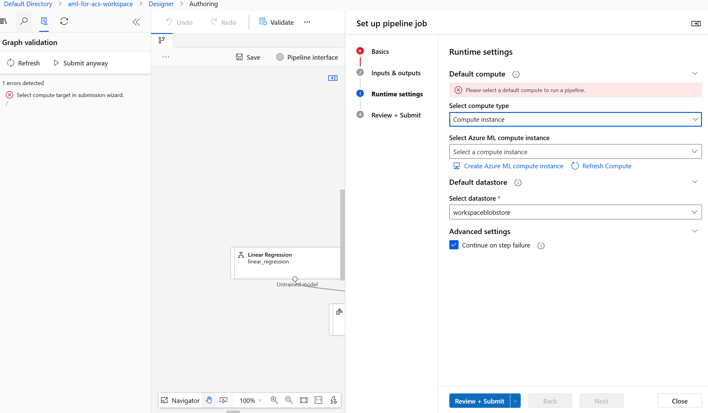
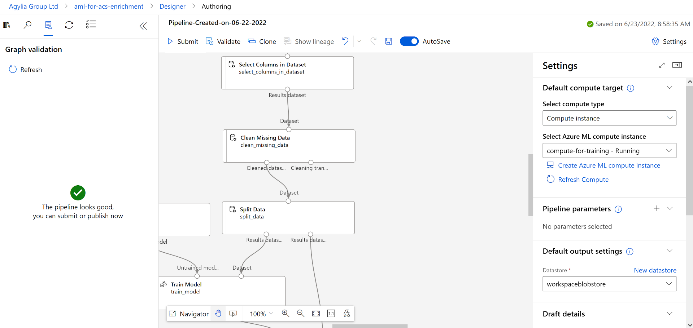
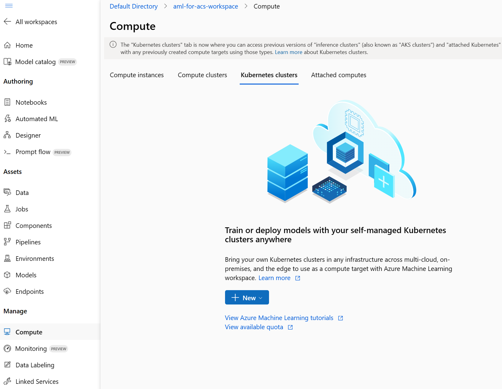

---
lab:
  title: Enriquecer um índice de pesquisa usando um modelo do Azure Machine Learning
---

# Enriquecer um índice de pesquisa usando um modelo do Azure Machine Learning

É possível usar o poder do aprendizado de máquina para enriquecer um índice de pesquisa. Para isso, use um modelo treinado no Azure AI Machine Learning Studio e chame-o de um conjunto de habilidades personalizado de aprendizado de máquina.

Neste exercício, você criará um modelo do Azure AI Machine Learning Studio para treinar, implantar e testar um ponto de extremidade. Em seguida, você criará um serviço do Azure Cognitive Search, criará dados de exemplo e enriquecerá um índice usando o ponto de extremidade do Azure AI Machine Learning Studio.

> **Observação** Para concluir este exercício, você precisará de uma assinatura do Microsoft Azure. Caso ainda não tenha uma, inscreva-se em uma avaliação gratuita em [https://azure.com/free](https://azure.com/free?azure-portal=true).
>

## Criar um workspace do Azure Machine Learning

Antes de enriquecer o índice de pesquisa, crie um workspace do Azure Machine Learning. O workspace fornecerá acesso ao estúdio do Azure AI Machine Learning, uma ferramenta gráfica que você pode usar para criar modelos de IA e implantá-los para uso.

1. Entre no [portal do Azure](https://portal.azure.com).
1. Selecione **+ Criar um recurso**.
1. Pesquise o aprendizado de máquina e selecione o **Azure Machine Learning**.
1. Selecione **Criar**.
1. Selecione **Criar novo** no **Grupo de recursos** e nomeie-o como **aml-for-acs-enrichment**.
1. Na seção de detalhes do Workspace, em **Nome**, insira **aml-for-acs-workspace**.
1. Selecione uma **Região** com suporte perto de você.
1. Use os valores padrão para a **Conta de armazenamento**, o **Cofre de chaves**, os **Insights do aplicativo** e o **Registro de contêiner**.
1. Selecione **Examinar + criar**.
1. Selecione **Criar**.
1. Aguarde a implantação do workspace do Azure Machine Learning e selecione **Acessar recurso**.
1. No painel Visão geral, selecione **Iniciar o Estúdio**.

## Criar um pipeline de treinamento de regressão

Agora você criará um modelo de regressão e o treinará usando um pipeline do Estúdio do Azure AI Machine Learning. Você treinará seu modelo de dados de preços de automóveis. O modelo, uma vez treinado, preverá o preço de um automóvel com base em seus atributos.

1. Na página inicial, selecione **Designer**.

1. Na lista de componentes predefinidos, selecione **Regressão ─ Previsão de preços de automóveis (Básico)**.

    

1. Selecione **Validar**.

1. No painel de **Validação de grafo**, selecione o erro **Selecionar destino de computação no assistente de envio**.

    
1. Na lista suspensa **Selecionar tipo de computação**, escolha **Instância de computação**. Em seguida, selecione **Criar instância de computação do Azure Machine Learning** abaixo.
1. No campo **Nome da computação**, insira um nome exclusivo (como **computação-para-treinamento**).
1. Selecione **Examinar + criar**e **Criar**.

1. No campo **Selecionar instância de computação do Azure Machine Learning**, selecione sua instância na lista suspensa. Talvez seja necessário aguardar até que o provisionamento seja concluído.

1. Selecione **Validar** novamente, o pipeline deve ter boa aparência.

    
1. Selecione **Noções básicas** no painel **Definir o trabalho de pipeline**.
1. Selecione **Criar novo** no nome do experimento.
1. Em **Nome do novo experimento**, insira **linear-regression-training**.
1. Selecione **Examinar + Enviar** e, em seguida, selecione **Enviar**.

### Criar um cluster de inferência para o ponto de extremidade

Enquanto o pipeline está treinando um modelo de regressão linear, é possível criar os recursos necessários para o ponto de extremidade. Esse ponto de extremidade precisa de um cluster do Kubernetes para processar solicitações da Web para seu modelo.

1. Selecione **Computação** à esquerda.

    
1. Selecione **Cluster do Kubernetes** e selecione **+ Novo**.
1. Na lista suspensa, selecione **AksCompute**.
1. No painel **Criar AksCompute**, selecione **Criar novo**.
1. Para **Localização**, selecione a mesma região que você usou para criar seus outros recursos.
1. Na lista de tamanhos de VM, selecione **Standard_A2_v2**.
1. Selecione **Avançar**.
1. Em **Nome da computação**, insira **aml-acs-endpoint**.
1. Selecione **Habilitar configuração de SSL**.
1. Em **Domínio de folha**, insira **aml-for-acs**.
1. Selecione **Criar**.

### Registrar o modelo treinado

O trabalho do pipeline deve ter sido concluído. Você baixará os arquivos `score.py` e `conda_env.yaml`. Em seguida, registrará o modelo treinado.

1. À esquerda, selecione **Trabalhos**.

    
1. Selecione o seu experimento e selecione seu trabalho concluído na tabela, por exemplo, **Regressão – previsão de preços de automóveis (Básico)**. Se for solicitado que você salve as alterações, selecione **Descartar** em alterações.
1. No designer, selecione **Visão geral do trabalho** no canto superior direito e, em seguida, selecione o nó **Treinar modelo**.

    
1. Na guia **Saídas + logs**, expanda a pasta **trained_model_outputs**.
1. Ao lado de `score.py`, selecione o menu Mais (**...**) e, em seguida, selecione **Download**.
1. Ao lado de `conda_env.yaml`, selecione o menu Mais (**...**) e, em seguida, selecione **Download**.
1. Selecione **+ Registrar modelo** na parte superior da guia.
1. No campo **Saída do trabalho**, selecione a pasta **trained_model_outputs**. Em seguida, selecione **Avançar** na parte inferior do painel.
1. Para o **Nome** do modelo, insira **carevalmodel**.
1. Em **Descrição**, insira **Um modelo de regressão linear para prever o preço dos carros.**.
1. Selecione **Avançar**.
1. Selecione **Registrar**.

### Editar o script de pontuação para responder à Pesquisa de IA do Azure corretamente

O Estúdio do Azure Machine Learning baixou dois arquivos para o local de download padrão do navegador da Web. É necessário editar o arquivo score.py para alterar como a solicitação e a resposta JSON são tratadas. Você pode usar um editor de texto ou um editor de código, como o Visual Studio Code.

1. No editor, abra o arquivo score.py.
1. Substitua todo o conteúdo da função de execução:

    ```python
    def run(data):
    data = json.loads(data)
    input_entry = defaultdict(list)
    for row in data:
        for key, val in row.items():
            input_entry[key].append(decode_nan(val))

    data_frame_directory = create_dfd_from_dict(input_entry, schema_data)
    score_module = ScoreModelModule()
    result, = score_module.run(
        learner=model,
        test_data=DataTable.from_dfd(data_frame_directory),
        append_or_result_only=True)
    return json.dumps({"result": result.data_frame.values.tolist()})
    ```

    Com este código Python:

    ```python
    def run(data):
        data = json.loads(data)
        input_entry = defaultdict(list)
        
        for key, val in data.items():
                input_entry[key].append(decode_nan(val))
    
        data_frame_directory = create_dfd_from_dict(input_entry, schema_data)
        score_module = ScoreModelModule()
        result, = score_module.run(
            learner=model,
            test_data=DataTable.from_dfd(data_frame_directory),
            append_or_result_only=True)
        output = result.data_frame.values.tolist()
        
        return {
                "predicted_price": output[0][-1]
        }    
    ```

    As alterações acima permitem que o modo receba um único objeto JSON com atributos de carro em vez de uma matriz de carros.

    A outra alteração é retornar somente o preço previsto do carro em vez de toda a resposta JSON.
1. Salve as alterações no editor de texto.

## Criar um ambiente personalizado

Em seguida, você criará um ambiente personalizado para poder implantar em um ponto de extremidade em tempo real.

1. No painel de navegação, selecione **Ambientes**.
1. Selecione a guia **Pontos de extremidade personalizados**.
1. Selecione **+ Criar**.
1. Para **Nome**, insira **my-custom-environment**.
1. Na lista de ambientes selecionados em **Selecionar tipo de ambiente**, selecione **automl-gpu:2**.
1. Selecione **Avançar**.
1. No computador local, abra o arquivo `conda_env.yaml` baixado anteriormente e copie o conteúdo dele.
1. Retorne ao navegador e selecione **conda_dependencies.yaml** no painel Personalizar.
1. No painel à direita, substitua seu conteúdo pelo código copiado anteriormente.
1. Selecione **Avançar**e, em seguida, selecione **Avançar** novamente.
1. Selecione **Criar** para criar seu ambiente personalizado.

## Implantar o modelo com o código de pontuação atualizado <!--Option for web service deployment is greyed out. Can't go further after trying several different things.-->

O cluster de inferência agora deve estar pronto para uso. Você também editou o código de pontuação para lidar com solicitações do conjunto de habilidades personalizado do Azure Cognitive Search. Agora é hora de criar e testar um ponto de extremidade para o modelo.

1. À esquerda, selecione **Modelos**.
1. Selecione o modelo que você registrou, **carevalmodel**.

1. Selecione **Implantar** e selecione **Ponto de extremidade em tempo real**.

    
1. Para **Nome**, insira **car-evaluation-endpoint**.
1. Para o **Tipo de computação**, selecione **Gerenciada**.
1. Para o **Tipo de autenticação**, selecione **Autenticação baseada em chave**.
1. Selecione **Avançar** e, em seguida, selecione **Avançar**.
1. Selecione **Avançar** novamente.
1. No campo **Selecionar um script de pontuação para inferência**, navegue até o arquivo `score.py` atualizado e selecione-o.
1. Na lista suspensa **Selecionar tipo de ambiente**, selecione **Ambientes personalizados**.
1. Marque a caixa de seleção em seu ambiente personalizado na lista.
1. Selecione **Avançar**.
1. Para a máquina virtual, selecione **Standard_D2as_v4**.
1. Defina a **Contagem de instâncias** para **1**.
1. Selecione **Avançar** e, em seguida, selecione **Avançar** novamente.
1. Selecione **Criar**.

Aguarde a implantação do modelo, que pode demorar até 10 minutos. Você pode verificar o status em **Notificações** ou na seção pontos de extremidade do Estúdio do Azure Machine Learning.

### Testar o ponto de extremidade do modelo treinado

1. À esquerda, selecione **Pontos de extremidade**.
1. Selecione **car-evaluation-endpoint**.
1. Selecione **Testar**, em **Inserir dados para testar o ponto de extremidade**, cole este exemplo JSON.

    ```json
    {
        "symboling": 2,
        "make": "mitsubishi",
        "fuel-type": "gas",
        "aspiration": "std",
        "num-of-doors": "two",
        "body-style": "hatchback",
        "drive-wheels": "fwd",
        "engine-location": "front",
        "wheel-base": 93.7,
        "length": 157.3,
        "width": 64.4,
        "height": 50.8,
        "curb-weight": 1944,
        "engine-type": "ohc",
        "num-of-cylinders": "four",
        "engine-size": 92,
        "fuel-system": "2bbl",
        "bore": 2.97,
        "stroke": 3.23,
        "compression-ratio": 9.4,
        "horsepower": 68.0,
        "peak-rpm": 5500.0,
        "city-mpg": 31,
        "highway-mpg": 38,
        "price": 0.0
    }
    ```

1. Selecione **Testar** e você deverá ver uma resposta:

    ```json
    {
        "predicted_price": 5790.948226933133
    }
    ```

1. Selecione **Consumir**.

    
1. Copie o **ponto de extremidade REST**.
1. Copie a **Chave primária**.

### Integrar um modelo do Azure Machine Learning à Pesquisa de IA do Azure

Em seguida, você cria um novo serviço do Cognitive Search e enriquece um índice usando um conjunto de habilidades personalizado.

### Criar um arquivo de teste

1. No [portal do Azure](https://portal.azure.com/learn.docs.microsoft.com?azure-portal=true), selecione Grupos de recursos.
1. Selecione **aml-for-acs-enrichment**.

    
1. Selecione a conta de armazenamento, por exemplo, **amlforacsworks1440637584**.
1. Selecione **Configuração** em **Configurações**. Em seguida, defina **Permitir acesso anônimo do Blob** como **Habilitado**.
1. Selecione **Salvar**.
1. Em **Armazenamento de dados**, selecione **Contêineres**. 
1. Crie um contêiner para armazenar os dados de índice selecionando **+ Contêiner**.
1. No painel **Novo contêiner**, em **Nome**, insira **docs-to-search**.
1. No **Nível de acesso anônimo**, selecione **Contêiner (acesso de leitura anônimo para contêineres e blobs)**.
1. Selecione **Criar**.
1. Selecione o contêiner **docs-to-search** que você criou.
1. Em um editor de texto, crie um documento JSON:

    ```json
    {
      "symboling": 0,
      "make": "toyota",
      "fueltype": "gas",
      "aspiration": "std",
      "numdoors": "four",
      "bodystyle": "wagon",
      "drivewheels": "fwd",
      "enginelocation": "front",
      "wheelbase": 95.7,
      "length": 169.7,
      "width": 63.6,
      "height": 59.1,
      "curbweight": 2280,
      "enginetype": "ohc",
      "numcylinders": "four",
      "enginesize": 92,
      "fuelsystem": "2bbl",
      "bore": 3.05,
      "stroke": 3.03,
      "compressionratio": 9.0,
      "horsepower": 62.0,
      "peakrpm": 4800.0,
      "citympg": 31,
      "highwaympg": 37,
      "price": 0
    }
    ```

    Salve o documento em seu computador como a extensão `test-car.json`.
1. No portal, selecione **Carregar**.
1. No painel **Carregar blob**, selecione **Procurar arquivos**, navegue até onde você salvou o documento JSON e selecione-o.
1. Escolha **Carregar**.

### Criar um recurso do Azure AI Search

1. No portal do Azure, na página inicial, selecione **+ Criar um recurso**.
1. Pesquise por **pesquisa** e, em seguida, selecione **Pesquisa de IA do Azure**.
1. Selecione **Criar**.
1. Em **Grupo de recursos**, selecione **aml-for-acs-enrichment**.
1. Em Nome do serviço, insira **acs-enriched**.
1. Para **Localização**, selecione a mesma região usada anteriormente.
1. Selecione **Examinar + criar**e **Criar**.
1. Aguarde a implantação dos recursos e selecione **Acessar grupo de recursos**.
1. Selecione **Importar dados**.
1. No painel **Conectar aos seus dados**, para o campo **Nome da fonte de dados**, selecione o Armazenamento de Blobs do Azure.
1. Em **Nome da fonte de dados**, insira **import-docs**.
1. Em **Modo de análise**, selecione **JSON**.
1. Em **Cadeia de conexão**, selecione **Escolher conexão existente**.
1. Selecione a conta de armazenamento para a qual você carregou, por exemplo, **amlforacsworks1440637584**.
1. No painel **Contêineres**, selecione **docs-to-search**. 
1. Escolha **Selecionar**.
1. Selecione **Avançar: adicionar habilidades cognitivas (opcional)**.

### Adicionar habilidades cognitivas

1. Expanda **Adicionar enriquecimentos** e selecione **Extrair nomes de pessoas**.
1. Selecione **Avançar: Personalizar índice de destino**.
1. Selecione **+ Adicionar campo** e, em **Nome do campo**, insira **predicted_price** na parte inferior da lista.
1. Em **Tipo**, selecione **Edm.Double** para a sua nova entrada.
1. Selecione **Recuperável** para todos os campos.
1. Selecione **Pesquisável** em **modelo**.
1. Selecione **Próximo: Criar um indexador**.
1. Selecione **Enviar**.

## Adicionar a habilidade AML ao conjunto de habilidades

Agora, substitua o enriquecimento de nomes de pessoas pelo conjunto de habilidades personalizado do Azure Machine Learning.

1. No painel Visão geral, selecione **Conjuntos de habilidades** em **Gerenciamento de pesquisa**.
1. Em **Nome**, selecione **azureblob-skillset**.
1. Substitua a definição de habilidades de `EntityRecognitionSkill` por este JSON e lembre-se de substituir os valores de ponto de extremidade e chave primária copiados:

    ```json
    "@odata.type": "#Microsoft.Skills.Custom.AmlSkill",
    "name": "AMLenricher",
    "description": "AML studio enrichment example",
    "context": "/document",
    "uri": "PASTE YOUR AML ENDPOINT HERE",
    "key": "PASTE YOUR PRIMARY KEY HERE",
    "resourceId": null,
    "region": null,
    "timeout": "PT30S",
    "degreeOfParallelism": 1,
    "inputs": [
      {
        "name": "symboling",
        "source": "/document/symboling"
      },
      {
        "name": "make",
        "source": "/document/make"
      },
      {
        "name": "fuel-type",
        "source": "/document/fueltype"
      },
      {
        "name": "aspiration",
        "source": "/document/aspiration"
      },
      {
        "name": "num-of-doors",
        "source": "/document/numdoors"
      },
      {
        "name": "body-style",
        "source": "/document/bodystyle"
      },
      {
        "name": "drive-wheels",
        "source": "/document/drivewheels"
      },
      {
        "name": "engine-location",
        "source": "/document/enginelocation"
      },
      {
        "name": "wheel-base",
        "source": "/document/wheelbase"
      },
      {
        "name": "length",
        "source": "/document/length"
      },
      {
        "name": "width",
        "source": "/document/width"
      },
      {
        "name": "height",
        "source": "/document/height"
      },
      {
        "name": "curb-weight",
        "source": "/document/curbweight"
      },
      {
        "name": "engine-type",
        "source": "/document/enginetype"
      },
      {
        "name": "num-of-cylinders",
        "source": "/document/numcylinders"
      },
      {
        "name": "engine-size",
        "source": "/document/enginesize"
      },
      {
        "name": "fuel-system",
        "source": "/document/fuelsystem"
      },
      {
        "name": "bore",
        "source": "/document/bore"
      },
      {
        "name": "stroke",
        "source": "/document/stroke"
      },
      {
        "name": "compression-ratio",
        "source": "/document/compressionratio"
      },
      {
        "name": "horsepower",
        "source": "/document/horsepower"
      },
      {
        "name": "peak-rpm",
        "source": "/document/peakrpm"
      },
      {
        "name": "city-mpg",
        "source": "/document/citympg"
      },
      {
        "name": "highway-mpg",
        "source": "/document/highwaympg"
      },
      {
        "name": "price",
        "source": "/document/price"
      }
    ],
    "outputs": [
      {
        "name": "predicted_price",
        "targetName": "predicted_price"
      }
    ]  
    ```

1. Selecione **Salvar**.

### Atualizar os mapeamentos do campo de saída

1. Volte para o painel **Visão geral**, selecione **Indexadores** e selecione **azureblob-indexer**.
1. Selecione a guia **Definição do indexador (JSON)** e altere o valor **outputFieldMappings** para:

    ```json
    "outputFieldMappings": [
        {
          "sourceFieldName": "/document/predicted_price",
          "targetFieldName": "predicted_price"
        }
      ]
    ```

1. Clique em **Salvar**.
1. Selecione **Redefinir** e **Sim**.
1. Selecione **Executar** e **Sim**.

## Testar o enriquecimento do índice

O conjunto de habilidades atualizado agora adicionará um valor previsto ao documento de carros de teste no índice. Para testar isso, siga estas etapas.

1. No painel **Visão geral** do serviço de pesquisa, selecione o **Gerenciador de pesquisa** na parte superior do painel.
1. Selecione **Pesquisar**.
1. Role até a parte inferior dos resultados.
    
Você deve ver o campo de preenchimento `predicted_price`.

## Excluir os recursos do exercício

Agora que você concluiu o exercício, exclua todos os recursos de que não precisa mais. Exclua os recursos do Azure:

1. No **portal do Azure**, selecione Grupos de recursos.
1. Selecione o grupo de recursos que você não precisa e, em seguida, selecione **Excluir grupo de recursos**.
