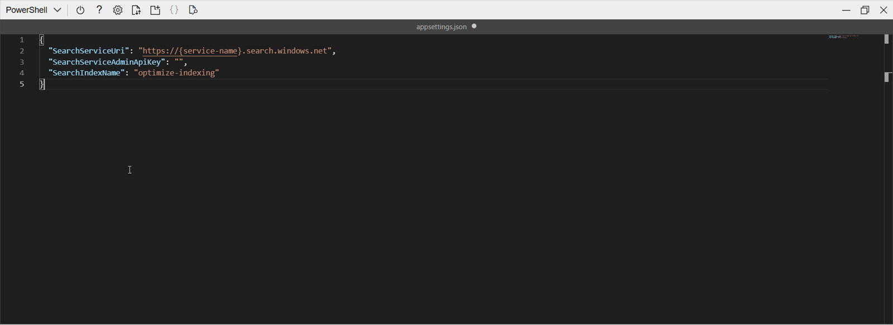

---
lab:
  title: Adicionar a um índice usando a API de push
---

# Adicionar a um índice usando a API de push

Você deseja explorar como criar um índice de Pesquisa de IA do Azure e carregar documentos para esse índice usando código C#.

Neste exercício, você clonará uma solução em C# existente e a executará para descobrir o tamanho ideal do lote para carregar documentos. Em seguida, você usará esse tamanho de lote e carregará documentos efetivamente usando uma abordagem com threading.

> **Observação** para concluir este exercício, você precisará de uma assinatura do Microsoft Azure. Caso ainda não tenha uma, inscreva-se em uma avaliação gratuita em [https://azure.com/free](https://azure.com/free?azure-portal=true) .

## Configurar os recursos do Azure

Para economizar tempo, selecione este modelo do Azure Resource Manager para criar os recursos que serão necessários posteriormente no exercício:

1. [Implantar recursos no Azure](https://portal.azure.com/#create/Microsoft.Template/uri/https%3A%2F%2Fraw.githubusercontent.com%2FMicrosoftLearning%2Fmslearn-knowledge-mining%2Fmain%2FLabfiles%2F07-exercise-add-to-index-use-push-api%2Fazuredeploy.json) – selecione este link para criar os seus recursos de IA do Azure.
    
1. Em **Grupo de recursos**, selecione **Criar** e dê a ele o nome **cog-search-language-exe**.
1. Em **Região**, selecione uma [região com suporte](/azure/ai-services/language-service/custom-text-classification/service-limits#regional-availability) próxima a você.
1. O **Prefixo do recurso** precisa ser globalmente exclusivo. Insira um prefixo com caracteres numéricos aleatórios e em letras minúsculas, por exemplo, **acs118245**.
1. Em **Local**, selecione a mesma região escolhida acima.
1. Selecione **Examinar + criar**.
1. Selecione **Criar**.
1. Quando a implantação for concluída, selecione **Ir para o grupo de recursos** para ver todos os recursos que você criou.

    

## Copiar informações da API REST do serviço Pesquisa de IA do Azure

1. Na lista de recursos, selecione o serviço de pesquisa que você criou. No exemplo acima, **acs118245-search-service**.
1. Copie o nome do serviço de pesquisa para um arquivo de texto.

    
1. À esquerda, selecione **Chaves** e copie a **Chave de administração primária** no mesmo arquivo de texto.

## Clonar o repositório no Cloud Shell

Você desenvolverá seu código usando o Cloud Shell no Portal do Azure. Os arquivos de código do seu aplicativo foram fornecidos em um repositório do GitHub.

> **Dica**: Se você já clonou o repositório **mslearn-knowledge-mining** recentemente, poderá ignorar essa tarefa. Caso contrário, siga estas etapas para cloná-lo em seu ambiente de desenvolvimento.

1. No Portal do Azure, use o botão **[\>_]** à direita da barra de pesquisa na parte superior da página para criar um Cloud Shell no portal do Azure selecionando um ambiente do ***PowerShell***. O Cloud Shell fornece uma interface de linha de comando em um painel na parte inferior do portal do Azure.

    > **Observação**: se você já criou um Cloud Shell que usa um ambiente *Bash*, alterne-o para o ***PowerShell***.

1. Na barra de ferramentas do Cloud Shell, no menu **Configurações**, selecione **Ir para a versão clássica** (isso é necessário para usar o editor de código).

    > **Dica**: conforme você colar comandos no cloudshell, a saída pode ocupar uma grande quantidade do espaço da tela. Você pode limpar a tela digitando o comando `cls` para facilitar o foco em cada tarefa.

1. No painel do PowerShell, insira os seguintes comandos para clonar o repositório GitHub para este exercício:

    ```
    rm -r mslearn-knowledge-mining -f
    git clone https://github.com/microsoftlearning/mslearn-knowledge-mining mslearn-knowledge-mining
    ```

1. Após o repositório ser clonado, navegue até a pasta que contém os arquivos de código do aplicativo:  

    ```
   cd mslearn-knowledge-mining/Labfiles/07-exercise-add-to-index-use-push-api/OptimizeDataIndexing
    ```

## Configurar o aplicativo

1. Usando o comando `ls`, você pode exibir o conteúdo da pasta **OptimizeDataIndexing**. Nela você encontrará um arquivo `appsettings.json` para definições de configuração.

1. Digite o seguinte comando para editar o arquivo de configuração que foi fornecido:

    ```
   code appsettings.json
    ```

    O arquivo é aberto em um editor de código.

    

1. Cole o nome do serviço de pesquisa e a chave de administração primária.

    ```json
    {
      "SearchServiceUri": "https://acs118245-search-service.search.windows.net",
      "SearchServiceAdminApiKey": "YOUR_SEARCH_SERVICE_KEY",
      "SearchIndexName": "optimize-indexing"
    }
    ```

    O arquivo de configurações deve ser semelhante ao acima.
   
1. Depois de substituir os espaços reservados, use o comando **CTRL+S** para salvar suas alterações e, em seguida, use o comando **CTRL+Q** para fechar o editor de código, mantendo a linha de comando do Cloud Shell aberta.
1. No terminal, insira `dotnet run` e pressione **Enter**.

    

    A saída mostra que, nesse caso, o tamanho do lote com o melhor desempenho é de 900 documentos com a maior taxa de transferência (MB/segundos).
   
    >**Observação**: os valores de taxa de transferência podem ser diferentes do que é mostrado na captura de tela. No entanto, o tamanho do lote com melhor desempenho ainda será o mesmo. 

## Editar o código para implementar o threading e uma estratégia de retirada e repetição

Há um código comentado que está pronto para alterar o aplicativo para usar threads para carregar documentos no índice de pesquisa.

1. Insira o comando a seguir para abrir o arquivo de código para o aplicativo cliente:

    ```
   code Program.cs
    ```

1. Comente as linhas 38 e 39 desta forma:

    ```csharp
    //Console.WriteLine("{0}", "Finding optimal batch size...\n");
    //await TestBatchSizesAsync(searchClient, numTries: 3);
    ```

1. Remova a marca de comentário das linhas 41 a 49.

    ```csharp
    long numDocuments = 100000;
    DataGenerator dg = new DataGenerator();
    List<Hotel> hotels = dg.GetHotels(numDocuments, "large");

    Console.WriteLine("{0}", "Uploading using exponential backoff...\n");
    await ExponentialBackoff.IndexDataAsync(searchClient, hotels, 1000, 8);

    Console.WriteLine("{0}", "Validating all data was indexed...\n");
    await ValidateIndexAsync(indexClient, indexName, numDocuments);
    ```

    O código que controla o tamanho do lote e o número de threads é `await ExponentialBackoff.IndexDataAsync(searchClient, hotels, 1000, 8)`. O tamanho do lote é 1000 e os threads são oito.

    

    O código será parecido com o acima.

1. Salve suas alterações.
1. Selecione seu terminal e depois pressione qualquer tecla para encerrar o processo em execução, se ainda não o tiver feito.
1. Execute `dotnet run` no terminal.

    O aplicativo iniciará oito threads e, à medida que cada thread terminar de gravar uma nova mensagem no console:

    ```powershell
    Finished a thread, kicking off another...
    Sending a batch of 1000 docs starting with doc 57000...
    ```

    Depois que 100.000 documentos forem carregados, o aplicativo gravará um resumo (isso pode demorar um pouco para completar):

    ```powershell
    Ended at: 9/1/2023 3:25:36 PM
    
    Upload time total: 00:01:18:0220862
    Upload time per batch: 780.2209 ms
    Upload time per document: 0.7802 ms
    
    Validating all data was indexed...
    
    Waiting for service statistics to update...
    
    Document Count is 100000
    
    Waiting for service statistics to update...
    
    Index Statistics: Document Count is 100000
    Index Statistics: Storage Size is 71453102
    
    ``````

Explore o código no procedimento `TestBatchSizesAsync` para ver como o código testa o desempenho do tamanho do lote.

Explore o código no procedimento `IndexDataAsync` para ver como o código gerencia o threading.

Explore o código no `ExponentialBackoffAsync` para ver como o código implementa uma estratégia de retirada e repetição exponencial.

Você pode pesquisar e verificar se os documentos foram adicionados ao índice no portal do Azure.


## Limpar

Agora que você concluiu o exercício, exclua todos os recursos de que não precisa mais. Comece com o código clonado em seu computador. Em seguida, exclua os recursos do Azure.

1. No **portal do Azure**, selecione Grupos de recursos.
1. Selecione o grupo de recursos que você criou para este exercício.
1. Selecione **Excluir grupo de recursos**. 
1. Confirme a exclusão e depois clique em **Excluir**.
1. Selecione os recursos de que você não precisa e selecione **Excluir**.
