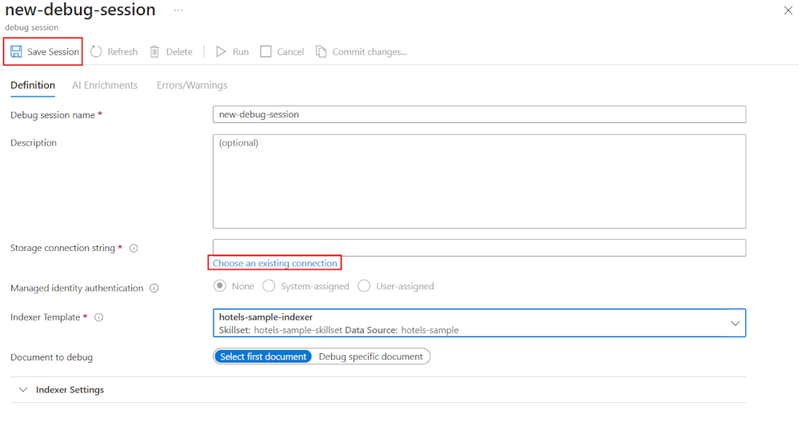

---
lab:
  title: Problemas de pesquisa de depuração
---

# Problemas de pesquisa de depuração

Você criou sua solução de pesquisa, mas notou que há alguns avisos no indexador.

Neste exercício, você criará uma solução da Pesquisa de IA do Azure, importará alguns dados de exemplo e resolverá um aviso no indexador.

> **Observação**: para concluir este exercício, você precisará de uma assinatura do Microsoft Azure. Caso ainda não tenha uma, inscreva-se em uma avaliação gratuita em [https://azure.com/free](https://azure.com/free?azure-portal=true).

## Criar a solução de pesquisa

Antes de começar a usar uma Sessão de Depuração, você precisa criar um serviço do Azure Cognitive Search.

1.  selecione este botão para implantar todos os recursos necessários no portal do Azure.

    

1. Em **Grupo de Recursos**, selecione **Criar**.
1. Digite **acs-cognitive-search-exercise**.
1. Selecione a **Região** mais próxima de você.
1. Em **Prefixo do Recurso**, insira **acslearnex** e adicione uma combinação aleatória de números ou caracteres para garantir que o nome do armazenamento seja exclusivo.
1. Para o Local, selecione a mesma região usada acima.
1. Na parte inferior do painel, selecione **Examinar + criar**.
1. Espere que os recursos sejam implantados e selecione **Ir para o grupo de recursos**.

## Importar dados de exemplo

Com os recursos criados, agora você pode importar os dados de origem.

1. Nos recursos listados, selecione o serviço de pesquisa.

1. No painel **Visão geral**, selecione **Importar dados**.

      

1. No painel de importação de dados, para a Fonte de Dados, selecione **Exemplos**.

      

1. Na lista de exemplos, selecione **hotels-sample**.
1. Selecione **Avançar: Adicionar habilidades cognitivas (opcional)**.
1. Expanda a seção **Adicionar enriquecimentos**.

    

1. Selecione **Habilidades Cognitivas de Texto**.
1. Selecione **Avançar: Personalizar índice de destino**.
1. Deixe os padrões e selecione **Avançar: Criar um indexador**.
1. Selecione **Enviar**.

## Usar uma sessão de depuração para resolver avisos no indexador

Agora, o indexador começará a ingerir 50 documentos. No entanto, se você verificar o status do indexador, verá que há avisos.

1. Selecione **Sessões de depuração** no painel esquerdo.

1. Selecione **+ Adicionar sessão de depuração**.

1. Selecione **Escolher uma conexão** existente para a cadeia de conexão de armazenamento e, em seguida, selecione sua conta de armazenamento.

    
1. Selecione **+ Contêiner** para adicionar um novo contêiner. Nomeie-o **acs-debug-storage**.

    

1. Defina o **Nível de acesso anônimo** para **Contêiner (acesso de leitura anônimo para contêineres e blobs)**.

1. Selecione **Criar**.
1. Selecione o novo contêiner na lista e selecione **Selecionar**.

1. Selecione **Salvar Sessão**.

    O grafo de dependência mostra que, para cada documento, há um erro sobre três habilidades.
    

1. Selecione **V3**.
1. No painel de detalhes de habilidades, selecione **Erros/Avisos(1)**.
1. Expanda a coluna **Mensagem** para ver os detalhes.

    Os detalhes são:

    *Código de idioma inválido “(Desconhecido)”. Idiomas com suporte: ar,cs,da,de,en,es,fi,fr,hu,it,ja,ko,nl,no,pl,pt-BR,pt-PT,ru,sv,tr,zh-Hans. Para obter mais detalhes, consulte https://aka.ms/language-service/language-support.*

Se você observar o grafo de dependência, a habilidade de detecção de linguagem terá saídas para as três habilidades com avisos. Além disso, a entrada de habilidade que está causando o erro é `languageCode`.

1. No grafo de dependência, selecione **Detecção de linguagem**.

    
    Examinando o JSON de configurações de habilidade, observe que o campo que está sendo usado para deduzir o a linguagem é o `HotelId`.

    Esse campo causará o erro, pois a habilidade não pode resolver a linguagem com base em uma ID.

## Resolver o aviso no indexador

1. Selecione **origem** em entradas e altere o campo para `/document/Description`.
    
1. Selecione **Salvar**.
1. Selecione **Executar**.

    

    O indexador não deve mais ter erros ou avisos. Agora, o conjunto de habilidades pode ser atualizado.

1. Selecione **Confirmar alterações...**

    
1. Selecione **OK**.

1. Agora você precisa certificar-se de que seu conjunto de habilidades esteja anexado a um recurso dos Serviços de IA do Azure, caso contrário, você atingirá a cotação básica e o indexador atingirá o tempo limite. Para fazer isso, selecione **Conjunto de habilidades** no painel esquerdo e, em seguida, selecione seu **hotels-sample-skillset**.

    
1. Selecione a guia Serviços** de IA** e, em seguida, selecione o recurso de serviços de IA na lista.

    
1. Selecione **Salvar**.

1. Agora execute seu indexador para atualizar os documentos com os enriquecimentos de IA fixos. Para fazer isso, selecione **Indexadores** no painel esquerdo, **hotels-sample-indexer** e **Executar**.  Quando terminar de ser executado, você verá que não haverá avisos.

    

> [!TIP]
> Agora que você concluiu o exercício, se você tiver terminado de explorar os serviços de Pesquisa de IA do Azure, exclua os recursos do Azure criados durante o exercício. A maneira mais fácil de fazer isso é excluir o grupo de recursos **acs-cognitive-search-exercise**.