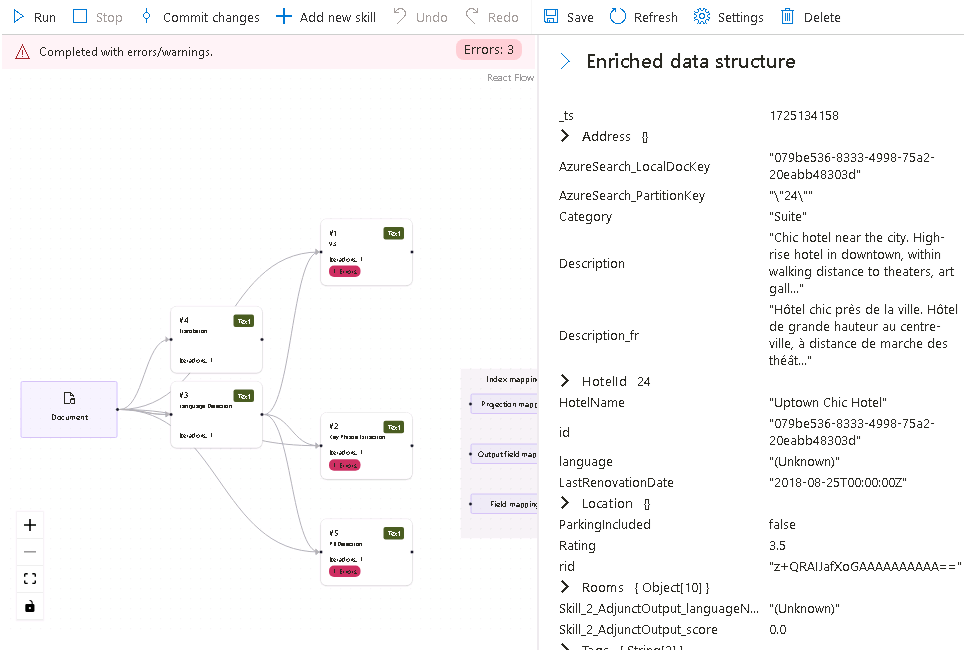
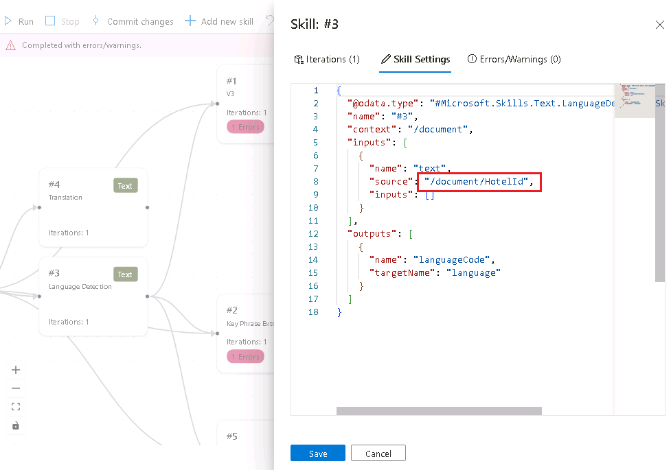

---
lab:
  title: Problemas de pesquisa de depuração
---

# Problemas de pesquisa de depuração

Você criou sua solução de pesquisa, mas notou que há alguns avisos no indexador.

Neste exercício, você criará uma solução da Pesquisa de IA do Azure, importará alguns dados de exemplo e resolverá um aviso no indexador.

> **Observação**: para concluir este exercício, você precisará de uma assinatura do Microsoft Azure. Caso ainda não tenha uma, inscreva-se em uma avaliação gratuita em [https://azure.com/free](https://azure.com/free?azure-portal=true).

## Criar a solução de pesquisa

Antes de começar a usar uma Sessão de Depuração, você precisa criar um serviço de Pesquisa de IA do Azure.

1. [Implantar recursos no Azure](https://portal.azure.com/#create/Microsoft.Template/uri/https%3A%2F%2Fraw.githubusercontent.com%2FMicrosoftLearning%2Fmslearn-knowledge-mining%2Fmain%2FLabfiles%2F08-debug-search%2Fazuredeploy.json) – se você estiver em uma VM hospedada, copie este link e cole no navegador da VM. Se não estiver, clique neste link para implantar todos os recursos necessários no portal do Azure.

    

1. Em **Grupo de Recursos**, selecione o grupo de recursos fornecido ou clique em **Criar novo** e digite **debug-search-exercise**.
1. Selecione a **Região** mais próxima de você ou deixe a padrão.
1. Em **Prefixo do Recurso**, insira **debugsearch** e adicione uma combinação aleatória de números ou caracteres para garantir que o nome do armazenamento seja exclusivo.
1. Para o Local, selecione a mesma região usada acima.
1. Na parte inferior do painel, selecione **Examinar + criar**.
1. Espere que os recursos sejam implantados e selecione **Ir para o grupo de recursos**.

## Importar dados de exemplo e configurar recursos

Com os recursos criados, agora você pode importar os dados de origem.

1. Nos recursos listados, navegue até a conta de armazenamento. Vá até **Configuração** no painel de navegação à esquerda, defina **Permitir acesso anônimo de Blob** como **Habilitado** e clique em **Salvar**.
1. Navegue de volta para o grupo de recursos e selecione o Registro de Serviço.
1. No painel **Visão geral**, selecione **Importar dados**.

      

1. No painel de importação de dados, para a Fonte de Dados, selecione **Exemplos**.

      

1. Na lista de exemplos, selecione **hotels-sample**.
1. Selecione **Avançar: Adicionar habilidades cognitivas (opcional)**.
1. Expanda a seção **Adicionar enriquecimentos**.

    

1. Selecione **Habilidades Cognitivas de Texto**.
1. Selecione **Avançar: Personalizar índice de destino**.
1. Deixe os padrões e selecione **Avançar: Criar um indexador**.
1. Selecione **Enviar**.

## Usar uma sessão de depuração para resolver avisos no indexador

Agora, o indexador começará a ingerir 50 documentos. No entanto, se você verificar o status do indexador, verá que há avisos.

1. Selecione **Sessões de depuração** no painel esquerdo.
1. Selecione **+ Adicionar sessão de depuração**.
1. Dê um nome para a sessão e selecione **hotel-sample-indexer** em **Modelo de Indexador**.
1. Selecione sua conta de armazenamento no campo **Conta de armazenamento**. Isso criará automaticamente um contêiner de armazenamento para você armazenar os dados de depuração.
1. Deixe a caixa de seleção para autenticação usando uma identidade gerenciada desmarcada.
1. Selecione **Salvar**.
1. Depois de criada, a sessão de depuração será executada automaticamente nos dados em seu serviço de pesquisa. A conclusão mostrará erros/avisos.

    O grafo de dependência mostra que, para cada documento, há um erro sobre três habilidades.
    

    > **Observação**: você pode ver um erro ao se conectar à conta de armazenamento e configurar identidades gerenciadas. Isso acontece se você tentar logo depois de habilitar o acesso anônimo ao blob, e a execução da sessão de depuração ainda funcionará. Atualizar a janela do navegador após alguns minutos removerá o aviso.

1. No grafo de dependência, selecione um dos nós de habilidade que apresentam um erro.
1. No painel de detalhes de habilidades, selecione **Erros/Avisos(1)**.

    Os detalhes são:

    *Código de idioma inválido '(Desconhecido)'. Idiomas aceitos: af,am,ar,as,az,bg,bn,bs,ca,cs,cy,da,de,el,en,es,et,eu,fa,fi,fr,ga,gl,gu,he,hi,hr,hu,hy,id,it,ja,ka,kk,km,kn,ko,ku,ky,lo,lt,lv,mg,mk,ml,mn,mr,ms,my,ne,nl,no,or,pa,pl,ps,pt-BR,pt-PT,ro,ru,sk,sl,so,sq,sr,ss,sv,sw,ta,te,th,tr,ug,uk,ur,uz,vi,zh-Hans,zh-Hant. Para mais detalhes, consulte https://aka.ms/language-service/language-support.*

    Se você observar o grafo de dependência, a habilidade Detecção de Idioma terá saídas para as três habilidades com erros. Se você observar as configurações de habilidade com erros, verá que a entrada de habilidade que está causando o erro é `languageCode`.

1. No grafo de dependência, selecione **Detecção de linguagem**.

    
    Examinando o JSON de configurações de habilidade, observe que o campo que está sendo usado para deduzir o a linguagem é o `HotelId`.

    Esse campo causará o erro, pois a habilidade não pode resolver a linguagem com base em uma ID.

## Resolver o aviso no indexador

1. Selecione **origem** em entradas e altere o campo para `/document/Description`.
1. Selecione **Salvar**.
1. Selecione **Executar**. O indexador não deve mais ter erros ou avisos. Agora, o conjunto de habilidades pode ser atualizado.

    
   
1. Selecione **Confirmar alterações** para enviar as alterações feitas nesta sessão para o indexador.
1. Selecione **OK**. Agora você pode excluir sua sessão.

Agora você precisa certificar-se de que seu conjunto de habilidades esteja anexado a um recurso dos Serviços de IA do Azure; caso contrário, você atingirá a cota básica e o indexador atingirá o tempo limite. 

1. Para fazer isso, selecione **Conjunto de habilidades** no painel esquerdo e, em seguida, selecione seu **hotels-sample-skillset**.

    
1. Selecione **Conectar Serviço de IA**, depois selecione o recurso de serviços de IA na lista.

    
1. Selecione **Salvar**.

1. Agora execute seu indexador para atualizar os documentos com os enriquecimentos de IA fixos. Para fazer isso, selecione **Indexadores** no painel esquerdo, **hotels-sample-indexer** e **Executar**.  Quando terminar de ser executado, você verá que não haverá avisos.

    

## Limpar

 Agora que você concluiu o exercício, se você tiver terminado de explorar os serviços de Pesquisa de IA do Azure, exclua os recursos do Azure criados durante o exercício. A maneira mais fácil de fazer isso é excluir o grupo de recursos **debug-search-exercise**.
