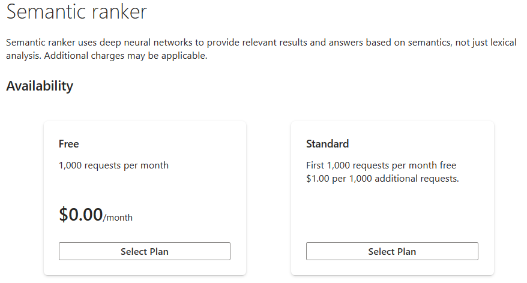
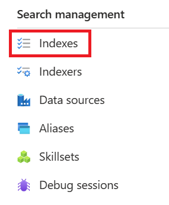

---
lab:
  title: Configurar a pesquisa semântica
---

# Configurar a pesquisa semântica

> **Observação** Para concluir este laboratório, você precisará de uma [assinatura do Azure](https://azure.microsoft.com/free?azure-portal=true) na qual tenha acesso administrativo. Este exercício também requer o serviço de Pesquisa de IA do Azure com uma camada faturável.

Neste exercício, você adicionará a pesquisa semântica a um índice e usará a pesquisa semântica para uma consulta.

## Habilitar a pesquisa semântica

1. Abra o portal do Azure e entre em sua conta.
1. Selecione **Todos os recursos** e selecione o serviço de pesquisa.
1. No painel de navegação, selecione **Pesquisa Semântica (versão prévia)**.
1. Em **Disponibilidade**, na opção **Gratuito**, selecione **Selecionar Plano**.



## Importar um índice de exemplo

1. Na home page do portal do Azure, selecione **Todos os recursos** e selecione seu serviço de pesquisa.
1. Selecione **Importar dados**.

    

1. Em **Fonte de Dados**, selecione **Exemplos**.
1. Selecione **hotels-sample** e selecione **Avançar: Adicionar habilidades cognitivas (Opcional)**.
1. Selecione **Passar para: Personalizar índice de destino**.
1. Selecione **Próximo: Criar um indexador**.
1. Selecione **Enviar**.

## Configurar classificação semântica

Depois que você tiver um índice de pesquisa e habilitar a pesquisa semântica, poderá configurar a classificação semântica. Você precisa de um cliente de pesquisa que dê suporte a APIs de visualização na solicitação de consulta. Você pode usar o Gerenciador de Pesquisa no portal do Azure, no aplicativo Postman, no SDK do Azure para .NET ou no SDK do Azure para Python. Neste exercício, você usará o Gerenciador de pesquisa no portal do Azure.

Para configurar a classificação semântica, siga estas etapas:

1. Na home page do portal do Azure, selecione **Todos os recursos** e selecione seu serviço de pesquisa.
1. Na barra de navegação, em **Gerenciamento de pesquisa**, selecione **Índices**.

    

1. Selecione seu índice.
1. Selecione **Configurações semânticas** e selecione **Adicionar configuração semântica**.
1. Em **Nome**, digite **hotels-conf**.
1. No **campo Título**, selecione **HotelName**.
1. Em **Campos de conteúdo**, em **Nome do campo**, selecione **Descrição**.
1. Repita as etapas anteriores para os seguintes campos:
    - **Categoria**
    - **Endereço/Cidade**
1. Em **Campos de palavra-chave**, no **Nome do campo**, selecione **Marcas**.
1. Selecione **Salvar**.
1. Na página de índice, selecione **Salvar**.
1. Na home page do portal do Azure, selecione **Todos os recursos** e selecione seu serviço de pesquisa.
1. Na barra de navegação, em **Gerenciamento de pesquisa**, selecione **Índices**.

    

1. Selecione seu índice.
1. Selecione **Gerenciador de pesquisa**.
1. Selecione **Exibir** e selecione **Exibição JSON**.
1. No editor de consultas JSON, digite o seguinte texto:

    ```json
        {
            "queryType": "semantic",
            "queryLanguage" : "en-us",
            "search": "all hotels near the water" , 
            "semanticConfiguration": "hotels-conf" , 
            "searchFields": "",
            "speller": "lexicon" , 
            "answers": "extractive|count-3",
            "count": true
        }
    ```

1. Selecione **Pesquisar**.
1. Examine os resultados da consulta.

## Limpar

Se você não precisar mais do serviço de Pesquisa de IA do Azure, deverá excluir o recurso de sua assinatura do Azure para reduzir custos.

>**Observação** Excluir seu serviço de Pesquisa de IA do Azure garante que a assinatura não seja cobrada pelos recursos. No entanto, você receberá a cobrança de uma pequena quantidade de armazenamento de dados, desde que o armazenamento exista em sua assinatura. Se terminar de explorar o serviço de Pesquisa Cognitiva, você poderá excluir o serviço de Pesquisa Cognitiva e os recursos associados. No entanto, se você planeja concluir qualquer outro laboratório desta série, será necessário recriá-lo.
> Para excluir seus recursos:
> 1. No [portal do Azure](https://portal.azure.com?azure-portal=true), na página **Grupos de recursos**, abra o grupo de recursos especificado durante a criação do serviço Cognitive Search.
> 1. Clique em **Excluir grupo de recursos**, digite o nome do grupo de recursos para confirmar que deseja excluí-lo e selecione **Excluir**.
